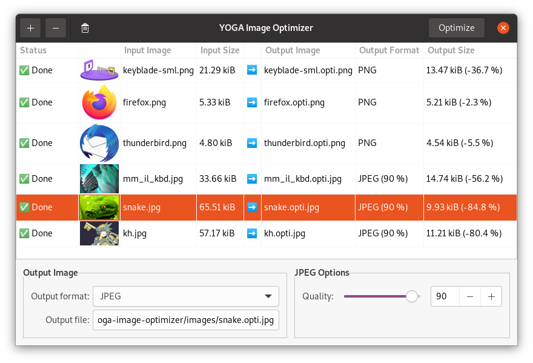

YOGA Image Optimizer
====================

|Github| |Discord| |Github Actions| |Black| |License|

**YOGA Image Optimizer** is a graphical user interface for `YOGA Image <https://github.com/wanadev/yoga>`_ that **converts and optimizes JPEGs, PNGs and WebP images**.

Limitations
-----------

As this is an early development version:

* PNG Optimization is very, very, **VERY** slow due to unbalanced ZoppfliPNG optimization options set by YOGA, this will be improved in the future.

Requirements
------------

* Python >= 3.7,
* YOGA >= 0.11.0,
* PyCairo,
* PyGObject >= 3. 36,

Install
-------

Linux (PyPI)
~~~~~~~~~~~~

First, you will need to install some dependencies on your system. On Debian and Ubuntu this can be achieved with the following command::

    sudo apt install git build-essential python3 python3-dev python3-pip libgirepository1.0-dev libcairo2-dev pkg-config gir1.2-gtk-3.0

Then install YOGA Image Optimizer using pip::

    sudo pip3 install yoga-image-optimizer

Windows
~~~~~~~

Download either the portable .zip version or the Windows installer from the release page:

* https://github.com/flozz/yoga-image-optimizer/releases

Usage
-----

To run YOGA Image Optimizer, just type the following command::

    yoga-image-optimizer

You can also pass some image files to open::

    yoga-image-optimizer  image1.png  image2.jpeg

Contributing
------------

Questions
~~~~~~~~~

If you have any question, you can:

* `open an issue <https://github.com/flozz/yoga-image-optimizer/issues>`_ on Github,
* or `ask on Discord <https://discord.gg/P77sWhuSs4>`_ (I am not always available for chatting but I try to answer to everyone).

Bugs
~~~~

If you found a bug, please `open an issue <https://github.com/flozz/yoga-image-optimizer/issues>`_ on Github with as much information as possible:

* What is your operating system / Linux distribution (and its version),
* How you installed the software,
* All the logs and message outputted by the software,
* ...

Pull Requests
~~~~~~~~~~~~~

Please consider `filing a bug <https://github.com/flozz/yoga-image-optimizer/issues>`_ before starting to work on a new feature. This will allow us to discuss the best way to do it. This is of course not necessary if you just want to fix some typo or small errors in the code.

Please note that your code must pass tests and follow the coding style defined by the `pep8 <https://pep8.org/>`_. `Flake8 <https://flake8.pycqa.org/en/latest/>`_ and `Black <https://black.readthedocs.io/en/stable/>`_ are used on this project to enforce coding style.

Running The Tests
~~~~~~~~~~~~~~~~~

You will first have to install `nox <https://nox.thea.codes/>`_::

    pip3 install nox

Then you can check for lint error::

    nox --session lint

or run the tests::

    nox --session test

To run the tests only for a specific Python version, you can use following commands (the corresponding Python interpreter must be installed on your machine)::

    nox --session test-3.7
    nox --session test-3.8
    nox --session test-3.9

You can also fix automatically coding style errors with::

    nox -s black_fix

Extract, Update or Build Translations
~~~~~~~~~~~~~~~~~~~~~~~~~~~~~~~~~~~~~

You will first have to install `nox <https://nox.thea.codes/>`_::

    pip3 install nox

To extract messages and update locales run::

    nox --session locales_update

To compile locales, run::

    nox --session locales_compile

**NOTE:** you will need to have ``xgettext``, ``msgmerge`` and ``msgfmt`` executable installed on your system to run the above commands. On Debian / Ubuntu, they can be installed with the following command::

    sudo apt install gettext

Changelog
---------

* **v0.99.2 (beta):**

  * Fix package data not installed while installing with pip (#3)
  * NOTE: no new release for Windows as nothing changed

* **v0.99.1 (beta):**

  * Fix site URL in setup.py
  * Fix version number

* **v0.99.0 (beta):**

  * Initial release
  * Linux and Windows support
  * Optimizes PNG, JPEG and WebP image formats

.. |Github| image:: https://img.shields.io/github/stars/flozz/yoga-image-optimizer?label=Github&logo=github
   :target: https://github.com/flozz/yoga-image-optimizer

.. |Discord| image:: https://img.shields.io/badge/chat-Discord-8c9eff?logo=discord&logoColor=ffffff
   :target: https://discord.gg/P77sWhuSs4

.. |Github Actions| image:: https://github.com/flozz/yoga-image-optimizer/actions/workflows/python-ci.yml/badge.svg
   :target: https://github.com/flozz/yoga-image-optimizer/actions

.. |Black| image:: https://img.shields.io/badge/code%20style-black-000000.svg
   :target: https://black.readthedocs.io/en/stable/

.. |License| image:: https://img.shields.io/github/license/flozz/yoga-image-optimizer
   :target: https://github.com/flozz/yoga-image-optimizer/blob/master/COPYING
